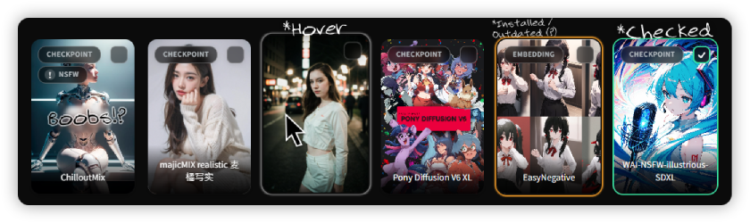

## ✨ Key features and changes in this fork:

**_All changes in this fork are marked in the code as `=== ANXETY EDITs ===`_** 
**_Treat this fork as an author's vision – it's not a fork that will fix absolutely every problem..._** 
**_But you can report bugs to me and I'll try to fix them! :33_**

<h1></h1>

- Redesigned the model cards in the browser to give them a modern look :3
- Added badges to model cards to display model type and NSFW status (if applicable) 
  _Note: Badges are only visible when `Tile Size` is set to 11 or higher._
- Model cards that require purchase are marked in gold. 
  _Note: The model type badge turns gold and displays a lightning icon :3_
- Implemented optional setting to change the resolution of model previews (Customize to your liking in settings - `Browser`)
- All CSS and JS files have been formatted using Prettier for consistent code style.
- Implemented encryption of image previews when images are saved (For Kaggle Only!) 
  _Note: The [Encrypt-Image](https://github.com/anxety-solo/sd-encrypt-image) extension must be installed to enable this feature._

#### 🔧 List of bugfixes and changes taken from Issues:

- Added an option to specify the number of model images to download (default: 16) [Issues #319](https://github.com/BlafKing/sd-civitai-browser-plus/issues/319)
  _The number of images to save can be configured in settings - `Downloads`_
- Fixed the display logic for the "Select All" button – now it only appears when there are models to select :3
- Fixed some issues with `sub_folder`. [Issues #356](https://github.com/BlafKing/sd-civitai-browser-plus/issues/356)
- Fixed error `cvitai_subfolders.json does not exist` _(It's not a bug, it's a feature...)_ [Issues #349](https://github.com/BlafKing/sd-civitai-browser-plus/issues/349)
- Added a way to search for a model by its `hash`. [Issues #309](https://github.com/BlafKing/sd-civitai-browser-plus/issues/309)
- Models are now saved using their original file names, without any extra or random IDs. [Issues #361](https://github.com/BlafKing/sd-civitai-browser-plus/issues/361)
- Complete removal of HyperNetwork support - should fix problems with launching in [Forge-Classic](https://github.com/Haoming02/sd-webui-forge-classic) ([Issue #390](https://github.com/BlafKing/sd-civitai-browser-plus/issues/390))
- Added a clarifying message about Early Access to avoid confusion~ [Issues #383](https://github.com/BlafKing/sd-civitai-browser-plus/issues/383)
- HTML description cleanup fix taken from [PR #384](https://github.com/BlafKing/sd-civitai-browser-plus/pull/384) 
  _(see `clean_description` in [scripts/civitai_file_manage.py](./scripts/civitai_file_manage.py))_

### 🖼️ Preview Cards (new style):

    <h6>🎨 For better WebUI experience, I recommend using my theme - <a href="https://github.com/anxety-solo/anxety-theme">Anxety-Theme</a> :3</h6>

<h1></h1>

---

### Extension for [Automatic1111's Stable Diffusion Web UI](https://github.com/AUTOMATIC1111/stable-diffusion-webui) and its forks :3

<h1>Features 🚀</h1>
<h3>Browse all models from CivitAI 🧩</h3>

* Explore a wide range of models at your fingertips.

<h3>Check for updates and installed models 🔄</h3>

* Easily spot new updates and identify already installed models while browsing.
* Ability to scan all installed models for available updates.

<h3>Download any Model, any version, and any file 📥</h3>

* Get the specific model version and file you need hassle-free.
* Download queue to avoid waiting for finished downloads.

<h3>Automatically assign tags to installed models 🏷️</h3>

* Assign tags by scanning all installed models for automatic use in image generation.

<h3>Quick Model Info Access 📊</h3>

* A button for each model card in txt2img and img2img to load it into the extension.
* A button under each image in model info to send its generation info to txt2img.

<h3>High-speed downloads with Aria2 🚄</h3>

* Maximize your bandwidth for lightning-fast downloads.

<h3>Sleek and Intuitive User Interface 🖌️</h3>

* Enjoy a clutter-free, user-friendly interface, designed to enhance your experience.

<h3>Actively maintained with feature requests welcome 🛠️</h3>

* Feel free to send me your feature requests, and I'll do my best to implement them!

<h1></h1>

# How to install 📘

<h3>Automatic Installation:</h3>

<h3>Manual Installation:</h3>

1. Download the latest version from this site and unpack the .zip

2. Navigate to your extensions folder (Your SD folder/webui/extensions)
3. Place the unpacked folder inside the extensions folder
4. Restart SD-WebUI

# Preview 👀

https://github.com/BlafKing/sd-civitai-browser-plus/assets/9644716/44c5c7a0-4854-4043-bfbb-f32fa9df5a74

# Star History 🌟

<a href="https://star-history.com/#BlafKing/sd-civitai-browser-plus&Date">
  <picture>
    <source media="(prefers-color-scheme: dark)" srcset="https://api.star-history.com/svg?repos=BlafKing/sd-civitai-browser-plus&type=Date&theme=dark" />
    <source media="(prefers-color-scheme: light)" srcset="https://api.star-history.com/svg?repos=BlafKing/sd-civitai-browser-plus&type=Date" />
    
  </picture>
</a>